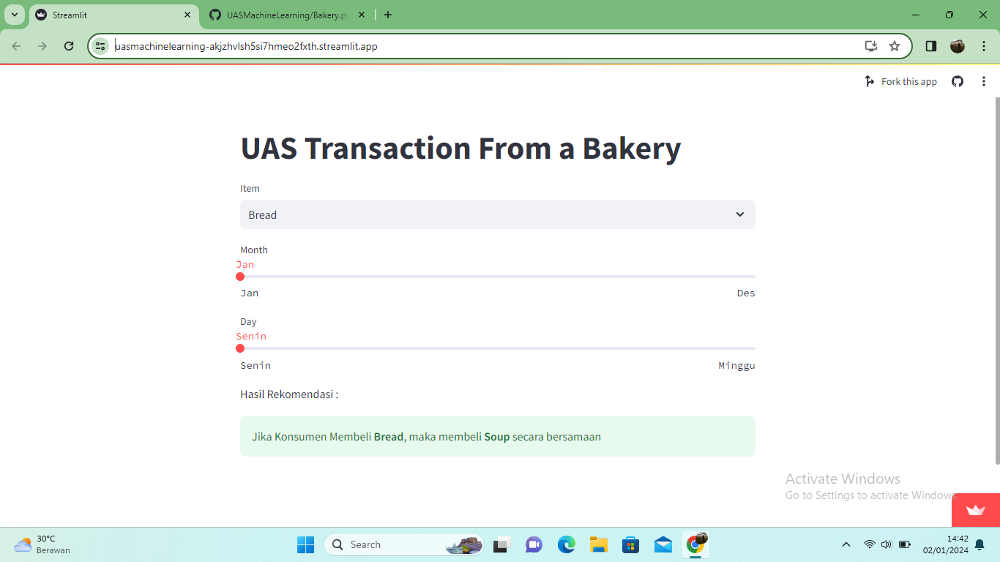

## Laporan Project Machine Learning
### Nama  : Salsabila Aulia Putri
### NIM   : 211351160
### Kelas : Malam A

## Domain Project
Project ini bertujuan untuk melihat kumpulan data transaksi dari sebuah toko roti dapat bervariasi tergantung pada kebutuhan bisnis atau analisis yang ingin dilakukan. Informasi ini dapat digunakan untuk merancang kampanye pemasaran yang lebih efektif.

## Business Understanding
Pada model ini kita dapat meningkatkan strategi pemasaran serta meningkatkan efisiensi operasional. Adapun pada model ini kita dapat mengidentifikasi waktu pembelian terbanyak untuk mengatur persediaan dan tenaga kerja dan menentukan produk paling populer untuk mengoptimalkan stok.

## Problem Statements
Jadi, dari data yang ada, kita kesulitan memahami info tentang produk yang biasanya dibeli secara bersamaan atau produk favorit pelanggan. Itu yang bikin susah buat atur stok dan strategi pemasaran yang efektif.

## Goals
Selanjutnya, kita perlu lebih paham tentang produk yang lagi hits dan ngerti pola belanja pelanggan agar bisa nge-boost strategi pemasarannya

## Solution Statements
Pada model ini kita dapat mengelola persediaan dengan melihat produk yang paling laris dan menganalisis data transaksi.

## Data Understanding
Data set yang digunakan untuk menyelesaikan beberapa permasalahan yang sudah dijelaskan. Adapun data ini memiliki 4 kolom dan 21.293 baris. Berikut data set yang saya gunakan dari kaggle :
https://www.kaggle.com/datasets/sulmansarwar/transactions-from-a-bakery?resource=download

## Variabel-variabel pada Transaction from a bakery dataset adalah sebagai berikut :
- Date : Variabel ini mencatat tanggal transaksi dan digunakan untuk menganalisis pola pembelian harian dan mengidentifikasi tren seiring waktu.
- Time : Variabel ini mencatat waktu transaksi, digunakan untuk menentukan periode waktu pembelian yang paling aktif dan mengelola staf toko secara efisien.
- Transaction : Variabel ini mencatat ID unik untuk setiap transaksi, digunakan untuk mengidentifikasi dan melacak setiap transaksi secara unik. Dapat membantu dalam menangani duplikasi atau kekosongan ID Transaksi.
- Item : Variabel ini mencatat nama produk atau layanan yang dibeli, digunakan untuk menganalisis produk yang paling populer, menentukan stok yang diperlukan, dan merancang strategi pemasaran.

## Data Preparation
Data prepartion atau persiapan data, merujuk pada serangkaian langkah dan proses yang dilakukan untuk mempersiapkan data mentah menjadi format yang dapat digunakan untuk analisis atau pemodelan. Berikut langkah-langkah untuk data preparation dimulai dari mendownload dataset dari kaggle

```javascript
from google.colab import files
files.upload()
```
Berikut masukkan kode berikut untuk menyalin file API Kaggle ke direktori tersebut

```javascript
!mkdir -p ~/.kaggle
!cp kaggle.json ~/.kaggle/
!chmod 600 ~/.kaggle/kaggle.json
!ls ~/.kaggle
```
Selanjutnya gunakan kode berikut untuk mengunduh dataset dari Kaggel yang menggunakan perintah khusus pada Kaggle CLI (Command Line Interface)

```javascript
!kaggle datasets download -d sulmansarwar/transactions-from-a-bakery
```

Kode berikut untuk mengesktrak isi dari file "transactions-from-a-bakery.zip" ke dalam direktori tersebut, dan menampilkan daftar file yang ada di dalamnya. 

```javascript
!mkdir transactions-from-a-bakery
!unzip transactions-from-a-bakery.zip -d transactions-from-a-bakery
!ls transactions-from-a-bakery
```

Kode di bawah ini digunain buat nge-load beberapa pustaka yang sering dipake buat analisis data dan bikin grafik. NumPy buat dukung array dan operasi matematika, pandas buat ngolah dan analisis data, matplotlib buat bikin grafik di Python, dan seaborn itu upgrade-nya matplotlib buat plot yang lebih bagus.

```javascript
import numpy as np
import pandas as pd
import matplotlib.pyplot as plt
import seaborn as sns
```

setelah ini, kode bakal baca data transaksi toko roti dari file CSV. Trus, dia bakal nge-print bentuk DataFrame-nya dan nunjukin beberapa baris awal data itu. Jadi, ini merupakan langkah awal buat ngulik data toko roti.

```javascript
data = pd.read_csv("transactions-from-a-bakery/BreadBasket_DMS.csv")
print("DataFrame shape :",data.shape)
data.head()
```

## Data Discovery
Selanjutnya untuk mengonversi kolom 'Date' dalam suatu DataFrame menjadi tipe data datetime Fungsi pd.to_datetime dapat digunakan untuk melakukan konversi tersebut.

```javascript
data['Date'] = pd.to_datetime(data['Date'], format= "%Y-%m-%d")
```

Kode dibawah berfungsi untuk mengetahui tipe data dari kolom "Date" dalam sebuah DataFrame yang disebut 'data'.

```javascript
data["Date"].dtype
```

Kode ini buat ambil informasi bulan sama hari dari kolom 'Date' lalu dimasukkan ke kolom-kolom baru itu. Jadi, bisa lebih mudah membaca data berdasarkan bulan atau hari dalam seminggu nanti.

```javascript
data["month"] = data['Date'].dt.month
data["day"] = data['Date'].dt.weekday
data.head()
```

## EDA
- Transaksi tiap bulan

kode ini fungsinya buat ngelompokin data berdasarkan bulan, terus diitung jumlah transaksinya tiap bulan. Lalu, hasilnya diurutin dari Oktober sampe April. Terakhir, pake Seaborn buat bikin diagram batang (bar plot) yang nunjukin jumlah transaksi tiap bulan dari Oktober sampe April. Jadi, bisa keliatan trendnya selama periode itu.

```javascript
data_perbulan = data.groupby('month')['Transaction'].count()
data_perbulan = pd.concat([data_perbulan.iloc[4:], data_perbulan.iloc[:4]])

plt.figure(figsize= (8,5))
sns.barplot(
    x = ["October", "November", "Desember", "January", "February", "March", "April"],
    y = data_perbulan.values, color="#D5AAD3")
plt.xticks(size = 12, rotation = -30)
plt.title("jumlah transaksi tiap bulan oktober - april, size = 16")
```


Selanjutnya saya menggunakan kode berikut untuk menghitung frekuensi kemunculan setiap nilai unik dalam kolom 'Item' dari suatu dataset.

```javascript
freq = (data['Item'].value_counts())
freq.head()
```

Kode berikut untuk membuat diagram batang (bar chart) yang menampilkan sepuluh produk teratas berdasarkan dukungan (support) mereka. 

```javascript
plt.figure(figsize = (15,5))
bars = plt.bar(x = np.arange(len(freq.head(10))), height = (freq).head(10),color='#D5AAD3')
plt.bar_label(bars, fontsize=12, color='white', label_type = 'center')
plt.xticks(ticks = np.arange(len(freq.head(10))), labels = freq.index[:10])

plt.title('Top 10 Products by Support')
plt.ylabel('Quantity')
plt.xlabel('Product Name')
plt.show()
```


Selanjutnya, kode berikut untuk ngelompokkin data dari kolom 'Transaction' dan ngehitung jumlah item yang ada dalam setiap transaksi. 

```javascript
member_shopping_frequency = data.groupby('Transaction')['Item'].count().sort_values(ascending=False)
print(member_shopping_frequency)
```
Kode berikut fungsi nya untuk buat histogram menggunakan library Seaborn (sns.histplot). Histogram ini nampilin distribusi frekuensi dari data yang ada dalam member_shopping_frequency

```javascript
sns.histplot(member_shopping_frequency, bins=8, kde=False,color='#D5AAD3')
plt.xlabel('Number of purchasing')
plt.ylabel('Number of Member')
plt.title('member_shopping_frequency')
plt.show()
```


Selanjutnya, untuk mengelompokkan data berdasarkan tanggal ('Date') dan menghitung jumlah transaksi untuk setiap tanggal saya menggunakan kode dibawah ini

```javascript
transactions_by_date = data.groupby('Date')['Transaction'].count()
```

untuk membuat dan menampilkan diagram garis (line plot) yang menunjukkan perkembangan jumlah transaksi seiring waktu saya memakai kode dibawah ini

```javascript
plt.figure(figsize=(15, 5))
plt.plot(transactions_by_date.index, transactions_by_date.values, linestyle='-')

plt.title('Transaction Count Over Time')
plt.xlabel('Date')
plt.ylabel('Transaction Count')
plt.grid(True)
plt.show()
```


Fungsi data.head() digunakan untuk menampilkan beberapa baris pertama dari suatu dataset atau frame data.

```javascript
data.head()
```

Kode selanjutnya digunakan untuk mengelompokkan data berdasarkan kolom 'day' (hari) dan menghitung jumlah transaksi untuk setiap hari.

```javascript
transactions_by_day = data.groupby('day')['Transaction'].count()
```

Untuk membuat sebuah plot garis menggunakan data dari transactions_by_day memerlukan kode dibawah ini

```javascript
plt.figure(figsize=(10, 6))
plt.plot(transactions_by_day.index, transactions_by_day.values, marker='o', linestyle='-')
```

Kode dibawah berfungsi untuk menambahkan elemen-elemen visual pada plot yang sedang dibuat menggunakan Matplotlib

```javascript
plt.title('Transaction Count by Day of the Week')
plt.xlabel('Day of the Week')
plt.ylabel('Transaction Count')
plt.xticks(range(7), ['Senin', 'Selasa', 'Rabu', 'Kamis', 'Jumat', 'Sabtu', 'Minggu'])

plt.grid(True)
plt.show()
```


## Preprocessing
- Data Preparation

untuk mengubah semua nilai dalam kolom "Item" menjadi huruf kecil (lowercase) menggunakan kode dibawah ini

```javascript
data["Item"] = data["Item"].apply(lambda item: item.lower())
```

Kode dibawah ini memiliki fungsi untuk menghapus spasi ekstra di awal dan akhir setiap nilai di kolom "Item" dari DataFrame data.

```javascript
data["Item"] = data["Item"].apply(lambda item: item.strip())
```

Selanjutnya kode dibawah ini berfungsi untuk buat salinan independen dari dua kolom ("Transaction" dan "Item") dari DataFrame asli dan lalu nampilin lima baris pertama dari DataFrame yang dipilih.

```javascript
data = data[["Transaction", "Item"]].copy()
data.head()
```

Selanjutnya pada kode ini kita dapat melakukan analisis asosiasi pada data dan mendapatkan aturan dan wawasan tentang hubungan antara item.

```javascript
from mlxtend.frequent_patterns import association_rules, apriori
```

 untuk menghitung jumlah kemunculan setiap kombinasi "Transaction" dan "Item" dalam dataframe data dan menampilkannya dalam dataframe baru bernama item_count, memerlukan kode berikut.

```javascript
 item_count = data.groupby(["Transaction", "Item"])["Item"].count().reset_index(name="Count")
item_count.head(10)
```

 kode berikut adalah untuk menggambarkan hubungan antara transaksi (indeks), item (kolom), dan jumlahnya (nilai di dalam tabel). Hasilnya adalah DataFrame baru yang disimpan dalam variabel item_count_pivot.

 ```javascript
 item_count_pivot = item_count.pivot_table(index='Transaction', columns='Item', values='Count', aggfunc='sum').fillna(0)
print("ukuran Dataset :", item_count_pivot.shape)
item_count_pivot.head()
```

untuk mengubah tipe data kolom atau struktur data tertentu menjadi tipe data integer 32-bit dan menampilkan beberapa baris pertama dari hasil transformasi saya memakai kode dibawah ini

```javascript
item_count_pivot = item_count_pivot.astype("int32")
item_count_pivot.head()
```

Kode ini mendefinisikan fungsi encode(x) yang akan mengubah nilai-nilai dalam suatu struktur data sesuai dengan aturan berikut:

- Jika nilai x kurang dari atau sama dengan 0, maka nilainya akan diubah menjadi 0.
- Jika nilai x lebih besar dari atau sama dengan 1, maka nilainya akan diubah menjadi 1.

```javascript
def encode(x):
  if x <=0:
    return 0
  elif x >=1:
    return 1

item_count_pivot = item_count_pivot.applymap(encode)
item_count_pivot.head()
```

Selanjutnya kode berikut digunakan untuk melihat ukuran dataset, jumlah transaksi dan jumlah item

```javascript
print("Ukuran dataset : ", item_count_pivot.shape)
print("Jumlah Transaksi : ", item_count_pivot.shape[0])
print("Jumlah items :", item_count_pivot.shape[1])
```

Kode ini bikin identifikasi itemset yang sering muncul bareng dalam satu set data. Jadi, bisa ngebantu liat kombinasi item yang kerap muncul bersama-sama. Lumayan buat ngerti pola pembelian atau kebiasaan lainnya dari data itu.

```javascript
support = 0.01
frequent_items = apriori(item_count_pivot, min_support= support, use_colnames=True)
frequent_items.sort_values("support", ascending=False).head(10)
```

jadi kode ini bikin aturan asosiasi dari sekelompok item yang sering muncul bareng (frequent items). Jadi, bisa dapetin insight tentang hubungan atau pola antar item dalam dataset.

```javascript
metric = "lift"
min_threshold = 1

rules = association_rules(frequent_items, metric=metric, min_threshold=min_threshold)[["antecedents","consequents","support","confidence","lift"]]
rules.sort_values('confidence', ascending=False, inplace=True)
rules.head(15)
```

Jadi, untuk bikin tiga subplot dalam satu gambar (figure) dengan ukuran 10x10, saya pakai kode di bawah ini. Setiap subplotnya bakal nunjukin hubungan antara beberapa metrik dari data yang mungkin terkait dengan analisis asosiasi atau aturan asosiasi. Jadi, bisa langsung lihat pola-pola keterkaitan tersebut dalam satu tampilan.

```javascript
plt.figure(figsize = (10, 10))
plt.style.use('seaborn-white')
#Plotting the relationship between the metrics
plt.subplot(221)
sns.scatterplot(x="support", y="confidence",data=rules)
plt.subplot(222)
sns.scatterplot(x="support", y="lift",data=rules)
plt.subplot(223)
sns.scatterplot(x="confidence", y="lift",data=rules)
```


kode ini dibuat buat ngehasilin representasi visual dari sekelompok aturan, dan nunjukin hubungan antara bagian yang ada di sebelumnya (pendahulu) dan bagian yang keluar setelahnya (konsekuensi) dalam tiap aturan.

```javascript
def draw_graph(rules, rules_to_show):
  import networkx as nx
  G1 = nx.DiGraph()

  color_map=[]
  N = 50
  colors = np.random.rand(N)
  strs=['R0', 'R1', 'R2', 'R3', 'R4', 'R5', 'R6', 'R7', 'R8', 'R9', 'R10', 'R11']


  for i in range (rules_to_show):
    G1.add_nodes_from(["R"+str(i)])


    for a in rules.iloc[i]['antecedents']:

        G1.add_nodes_from([a])

        G1.add_edge(a, "R"+str(i), color=colors[i] , weight = 2)

    for c in rules.iloc[i]['consequents']:

            G1.add_nodes_from([a])

            G1.add_edge("R"+str(i), c, color=colors[i],  weight=2)

  for node in G1:
       found_a_string = False
       for item in strs:
           if node==item:
                found_a_string = True
       if found_a_string:
            color_map.append('yellow')
       else:
            color_map.append('green')

  edges = G1.edges()
  colors = [G1[u][v]['color'] for u,v in edges]
  weights = [G1[u][v]['weight'] for u,v in edges]

  pos = nx.spring_layout(G1, k=16, scale=1)
  nx.draw(G1, pos, node_color = color_map, edge_color=colors, width=weights, font_size=16, with_labels=False)

  for p in pos:  # raise text positions
           pos[p][1] += 0.07
  nx.draw_networkx_labels(G1, pos)
  plt.show()

#Calling function with 10 rules
draw_graph(rules, 10)
```


## deployment
[TrasactionbakeryAPP](https://uasmachinelearning-akjzhvlsh5si7hmeo2fxth.streamlit.app/)



